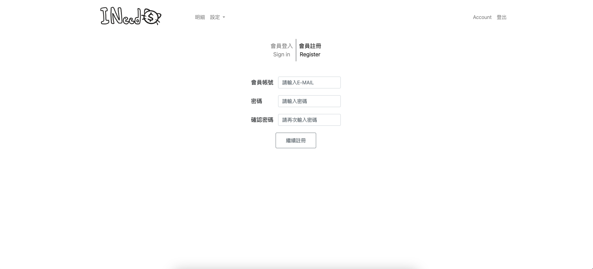
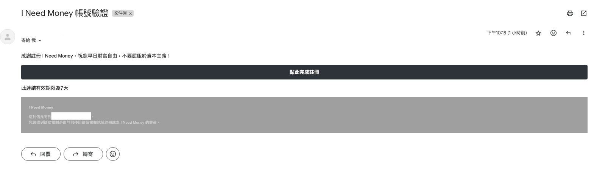
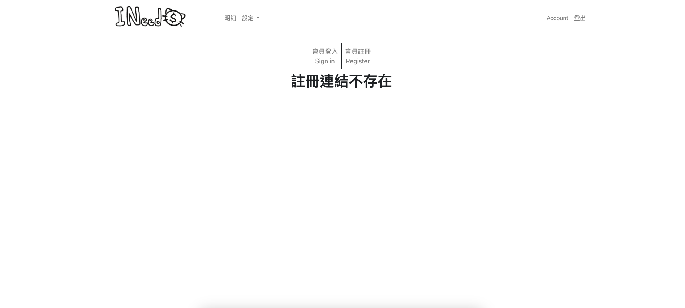
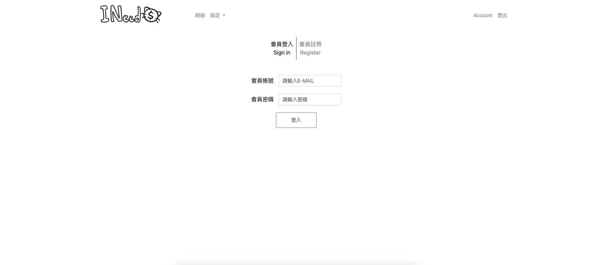
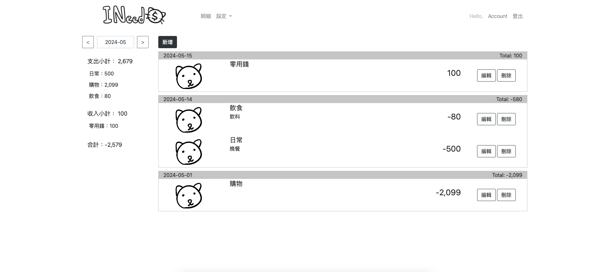
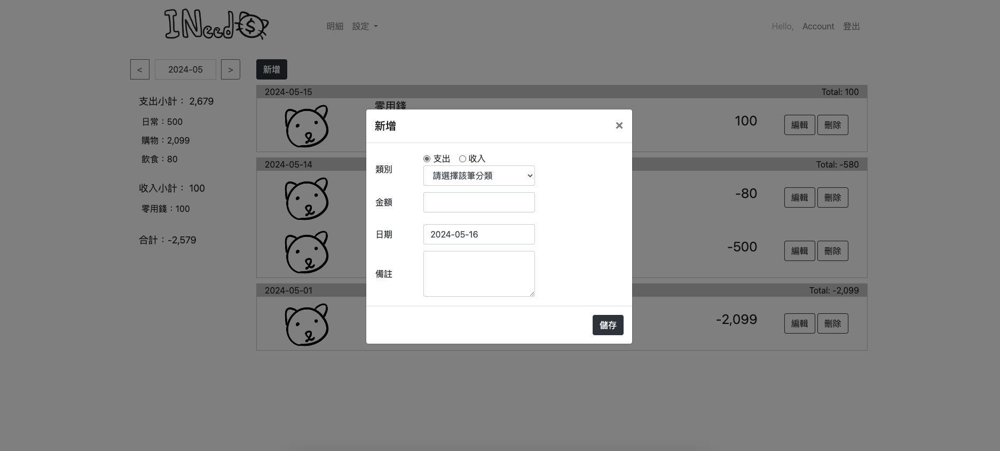
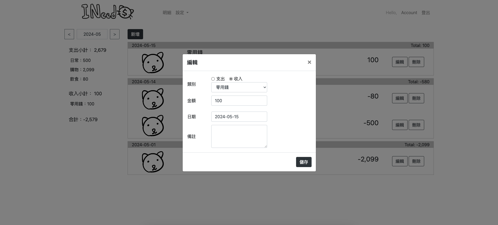
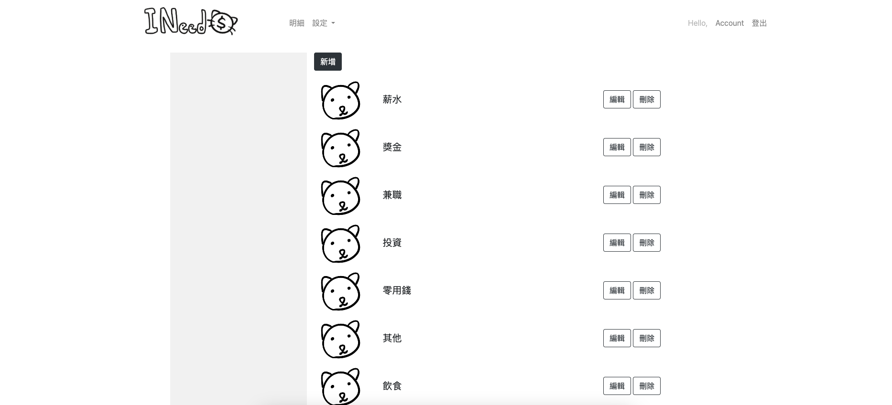
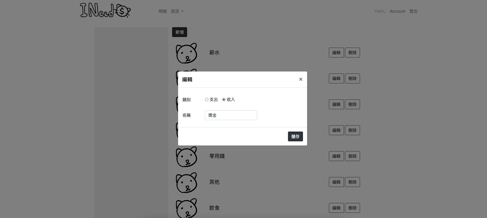
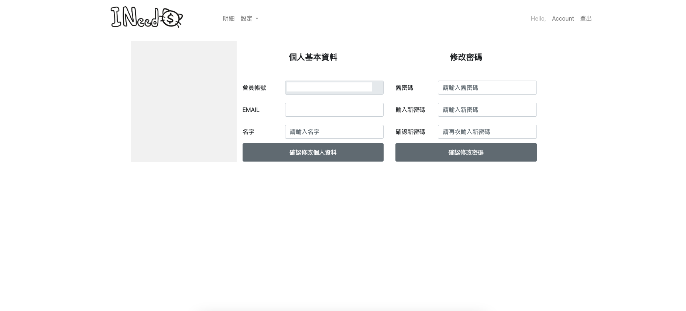

# Accounting Web
- Frontend uses JavaScript and BootStrap.
- Backend is built on the Django framework.
- The database employed is SQLite.

## I. System Functions
### (1) Registration Page
- User account registration.
- System sends a verification account link via email during registration.
- Click on the email link to confirm registration.

User Registration


Registration Confirmation Email


Clicking on Registration Confirmation Email Link - Successful Registration


Clicking on Registration Confirmation Email Link - Registration Failure


### (2) Login Page
- User account login.

Login


### (3) Detail Page
- Accessible only after login.
- Data query based on month.
- Add/Edit/Delete income and expense data.

Default search condition set to the current month


Add/Edit Data Form



### (4) Category Setting Page
- Accessible only after login.
- Add/Edit/Delete category data.



Add/Edit Data Form



### (5) User Data Settings
- Update personal information.
- Reset password.
- Delete account.


## II. Using This Project
Demo Environment: macOS
### STEP1 clone & cd this folder
```shell
git clone https://github.com/marukomaru777/Accounting-System.git # clone project
cd Accounting-System # navigate to project folder
```

### STEP2 create virtual environment & install package
virtual environment
```shell
python3 -m venv env # create new virtual environment
source env/bin/activate # activate virtual environment
```

install package
```shell
pip3 install -r requirements.txt # install package
```

### STEP3 migrate database
Using sqlite
```shell
python3 manage.py makemigrations
python3 manage.py migrate
```

### STEP4 Configure `Accounting-System/setting.py`
1. `SECRET_KEY`
Manually generate
```python
from django.core.management.utils import get_random_secret_key
print(get_random_secret_key())
```

```python
SECRET_KEY = "your_generated_secret_key_here"
```

2. `ALLOWED_HOSTS`
Set to localhost
```python
ALLOWED_HOSTS = ["127.0.0.1"]
```

3. `LINE_CHANNEL_ACCESS_TOKEN`, `LINE_CHANNEL_SECRET`
Obtain channel secret and channel access token from [Line Developers](https://developers.line.me/console/).

4. `CSRF_TRUSTED_ORIGINS"`
Set to localhost
```python
CSRF_TRUSTED_ORIGINS = ["https://*.127.0.0.1"]
```

5. `EMAIL_HOST_USER`, `EMAIL_HOST_PASSWORD`
Get app password from [Gmail app password](https://dev.to/krishnaa192/creating-google-app-password-for-django-project-4oj3).
```python
EMAIL_HOST_USER = "your_gmail_account"
EMAIL_HOST_PASSWORD = "your_app_password"
```

6. `WEB_URL`
Set to localhost; update for domain change
```python
WEB_URL = "https://*.127.0.0.1"
```

### STEP5 Migrate Database
```shell
python3 manage.py migrate
```

After settings, start locally.

### STEP6 Modify vs code launch.json
Specify port: 3000
```json
// launch.json
"args": [
    "runserver",
    "3000", // specify port, default is 8000 if not provided
]
```

### STEP7 Use ngrok for external connection
1. Install and start ngrok
[Download ngrok](https://ngrok.com/download) and install
```shell
ngrok authtoken <token>
```

Start ngrok with specified port (`<port>` should match the port specified in launch.json)
```shell
ngrok http <port>
```
This will generate a random URL for external connection.

2. Modify `Accounting-System/setting.py`
Update the following with the ngrok-generated URL
- `ALLOWED_HOSTS`
- `CSRF_TRUSTED_ORIGINS`
- `WEB_URL`

Once done, you can connect externally.

**Unfinished Section Below**
## III. System Design
### (1) Database Design

### (2) APP
- `users`: Operations related to users
- `accounting`: Operations related to income and expense records
